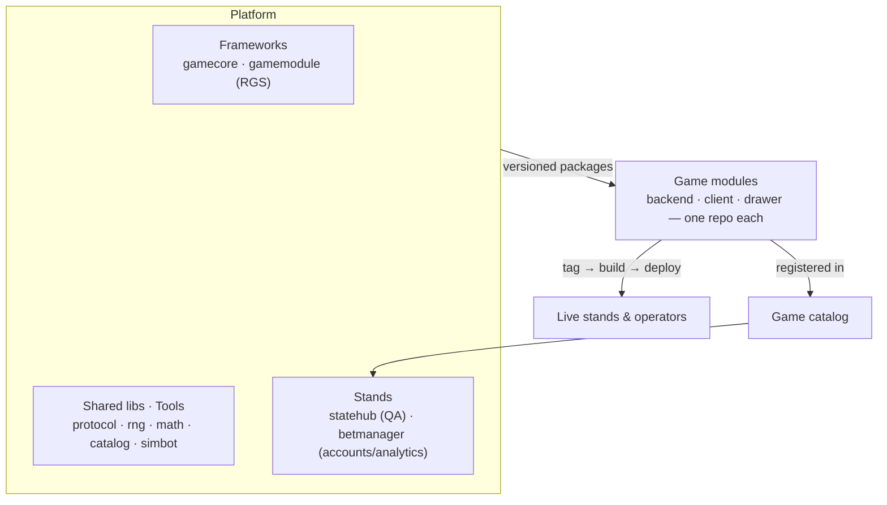

<picture>
  <source media="(prefers-color-scheme: dark)" srcset="assets/logo-dark.svg">
  
</picture>

### Spin. State. Repeat.

**A slot-games provider platform** — engine frameworks, a thin client renderer,
and the stands that test, catalog, and ship games.

[acidstates.com](https://acidstates.com)

---

## Platform at a glance

## How we build games

> **Install the framework as a package → write the module → its own repo → tag → deploy from the tag.**

Each game is a small, independent module that consumes a versioned framework — so games ship on
their own cadence while the platform evolves underneath them.

## Products

| Surface | What it is |
|---|---|
| **gamecore / gamemodule** | The client renderer (TS + PIXI) and the server RGS (Python + FastAPI). |
| **statehub** | QA test-stand — runs any catalog game in an embedded player. |
| **betmanager** | Accounts, wallets, and analytics across games, players, and bets. |
| **catalog** | The registry mapping every game to its pinned `{module, client, drawer}`. |

---

© AcidStates · built for scale, shipped on tags.

