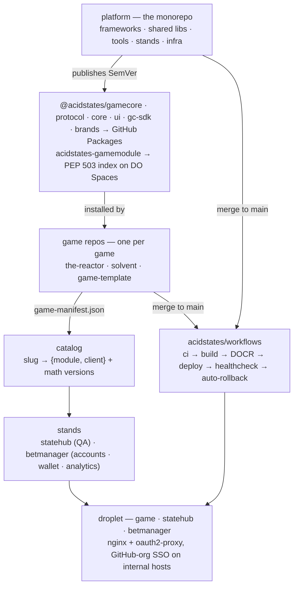

<picture>
  <source media="(prefers-color-scheme: dark)" srcset="assets/logo-dark.svg">
  
</picture>

### Spin. State. Repeat.

**A slot-games provider platform** — engine frameworks, a thin client renderer,
and the stands that test, catalog, and ship games.

[acidstates.com](https://acidstates.com)

---

## Platform at a glance

```mermaid
flowchart TD
  PLAT["platform — the monorepo<br/>frameworks · shared libs · tools · stands · infra"]
  PKG["@acidstates/gamecore · protocol · core · ui · gc-sdk · brands → GitHub Packages<br/>acidstates-gamemodule → PEP 503 index on DO Spaces"]
  GAMES["game repos — one per game<br/>the-reactor · solvent · game-template"]
  CAT["catalog<br/>slug → {module, client} + math versions"]
  CI["acidstates/workflows<br/>ci → build → DOCR → deploy → healthcheck → auto-rollback"]
  STANDS["stands<br/>statehub (QA) · betmanager (accounts · wallet · analytics)"]
  LIVE["droplet — game · statehub · betmanager<br/>nginx + oauth2-proxy, GitHub-org SSO on internal hosts"]
  PLAT -->|publishes SemVer| PKG
  PKG -->|installed by| GAMES
  GAMES -->|game-manifest.json| CAT
  GAMES -->|merge to main| CI
  PLAT -->|merge to main| CI
  CAT --> STANDS
  CI --> LIVE
  STANDS --> LIVE
```

## How we build games

> **Install the framework as a package → write the module → its own repo → merge to `main` → it deploys itself.**

Each game is a small, independent module that consumes a versioned framework — so games ship on
their own cadence while the platform evolves underneath them. Deploy hangs on the merge, not on a
tag: SemVer tags version *packages*, `main` ships *services*, and every accepted deploy gets
marked with a `deploy/<target>/…` tag after the fact. Every step that ships code to a running service
health-checks itself and rolls back on failure, so rollback is a fallback, never the first response.

## Live now

**The Reactor** — a 6×5 periodic-table slot whose whole board lives inside a rusted glass tank:
symbols settle under water behind a breathing surface, nozzles in the lid, coolant piped through
the base, a painted lab backdrop behind it. The board, the symbols and their VFX are canvas-baked
procedural PixiJS v8 — no sprite atlas, no Spine — with AVIF set-dressing and an alpha-channel
WebM fire loop layered around them, and the reels, win engine and RGS math driving it underneath.

**SOLVENT** — a 6×5 / 25-line cascade slot built on reagent flasks. The board tumbles until
nothing more can be taken off it: an explosion symbol clears the zone around itself for free, just
to keep the chain alive, a detonator lifts every copy of the symbols it touches and pays for the
whole group, and free spins swap the roster for value jars that a collector cashes in. Visually
the opposite bet from The Reactor — a flat printed comic on newsprint, a screen-space halftone
shader and `tint` instead of PBR and glow, vector-fit scenes and a tiered symbol atlas, with
procedural code drawing the flask rig and the effects on top.

Both games are pinned in the platform catalog, run on the same RGS framework, and seal their
payout path with the same framework primitive: a test fails the build the moment a money-moving
file drifts out of the seal. SOLVENT pins its list file by file — game loop, cascade, blast,
reels, flasks, free spins, constants, round model — plus the whole settings inheritance chain;
The Reactor's payout path lives in one module, sealed together with its own settings chain.

## Repositories

| Repo | What it is |
|---|---|
| [`platform`](https://github.com/acidstates/platform) | The monorepo: `gamecore` (TS + PixiJS client framework) · `gamemodule` (Python/FastAPI RGS) · shared libs (protocol, core, ui, gc-sdk, brands, rng, mathengine, admin-ui, simbot) · tools (registry/catalog, vector-fit, vf-lab, guards, eslint-rules) · stands (`statehub`, `betmanager`) · infra (nginx, oauth2-proxy, demo-gate) · the agent knowledge base (`docs/agent`). |
| [`the-reactor`](https://github.com/acidstates/the-reactor) | Flagship game — RGS backend + PixiJS client, one monorepo. |
| [`solvent`](https://github.com/acidstates/solvent) | Second live game — cascade + flasks. Forked from The Reactor's game backend onto the same `gamemodule` framework, with its own comic-styled client. |
| [`game-template`](https://github.com/acidstates/game-template) | Starter for new game modules: one script renames every identifier, regenerates goldens and runs the new repo's backend gates green. |
| [`workflows`](https://github.com/acidstates/workflows) | Org-wide reusable GitHub Actions — all deploy logic lives here; working repos carry thin callers only. |
| [`workspace`](https://github.com/acidstates/workspace) | Umbrella repo: org-wide agent rules (`CLAUDE.md`/`AGENTS.md`), org-level skills, cross-repo specs and shared tooling. |

## Products

| Surface | What it is |
|---|---|
| **gamecore / gamemodule** | The client renderer (TS + PixiJS v8) and the server RGS (Python + FastAPI) — the two published products. |
| **statehub** | QA test-stand — the game catalog with an embedded player, device mockups and test panels. |
| **betmanager** | Accounts, wallets, ledger and cross-game analytics, with its `betmanager-admin` SPA behind GitHub-org SSO. |
| **catalog** | The registry mapping every game to its pinned `{module, client}` and the math versions its backend will accept. |
| **simbot** | RTP and compliance simulation — tens of millions of rounds per math version for a certification run, plus `acid-math-gate`, an RTP-corridor check (per-game `math_gate.json`, 100k rounds by default). |
| **vector-fit / vf-lab** | An SVG scene becomes a typed `layout.json`: the vector stays the source of coordinates, hit-zones and animations, a raster skin is fitted on top. `vf-lab` is the dev-only authoring stand. |

## How it ships

Merging a PR into `main` builds and deploys — no manual SSH, no per-developer setup. The logic
lives in one place, [`acidstates/workflows`](https://github.com/acidstates/workflows):

| Workflow | What it does |
|---|---|
| `ci-game` | PR gates — backend `uv sync + ruff + pyright + pytest`, client `typecheck + build + test` |
| `build-push-image` | buildx → DigitalOcean Container Registry, tagged by commit SHA |
| `deploy-container` | ship compose → pull by tag → up → healthcheck → auto-rollback → deploy tag |
| `deploy-static` | build → backup → rsync → smoke → auto-restore → deploy tag |
| `deploy-game` | orchestrator: diff-detect backend vs client → ci → build → deploy → register manifest, rebuild catalog |
| `deploy-infra` | nginx + oauth2-proxy: `nginx -t` → reload → smoke four vhosts and oauth2-proxy `/ping` → restore both on any failure |

A game declares *where* it deploys in its `game-manifest.json` `deploy` block — image, compose
directory, healthcheck, client directory, smoke host. That block is the entire contract between a
game repo and the org's CI: `game-template` ships it as `CHANGE-ME` on purpose, and CI refuses to
ship an unfilled manifest. Deploy is also reachable by hand through `workflow_dispatch` — the
escape hatch for the day GitHub accepts a merge without emitting a push event — and the gates are
not skipped when it is used.

## Agent-ready by design

The codebase ships its own operating manual for AI coding agents: `CLAUDE.md`/`AGENTS.md`
conventions cascading from the umbrella repo down into every working repo, a battle-tested PixiJS
hero-VFX style guide distilled from real debugging rounds (`platform → docs/agent`), a
machine-readable repo map and a charter of locked decisions, plus the official
[pixijs-skills](https://github.com/pixijs/pixijs-skills) vendored into `.claude/skills/` with
org overlays verified against the installed `pixi.js@8.19.0` — so an agent's first drawing
session already knows the pitfalls a human only learns by shipping.

---

© AcidStates · built for scale, shipped on merge.

