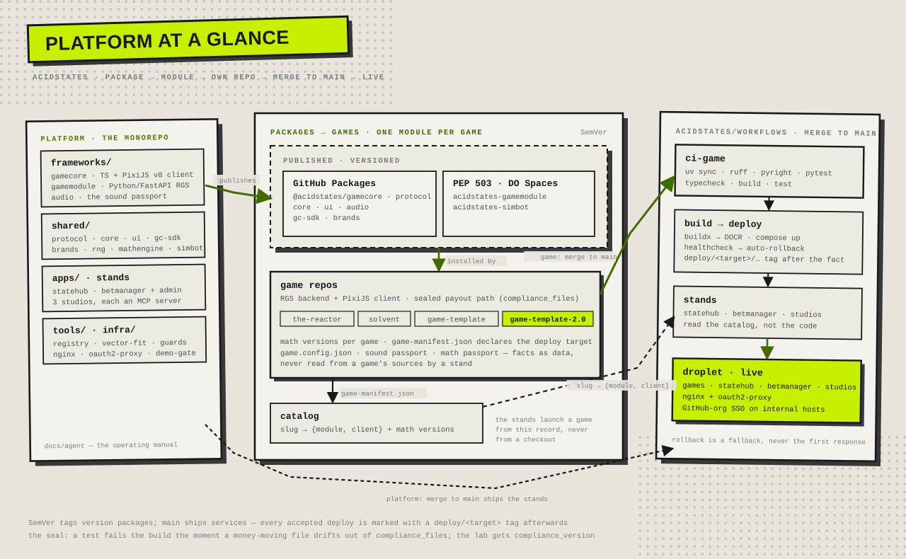

<picture>
  <source media="(prefers-color-scheme: dark)" srcset="assets/logo-dark.svg">
  
</picture>

### Spin. State. Repeat.

**A slot-games provider platform** — a Python RGS framework, a thin PixiJS client framework,
a sound passport, a simulator that prints the math passport for the lab, and the stands that
test, catalog and ship games.

[acidstates.com](https://acidstates.com)

---

**Live: The Reactor · SOLVENT** — both on `acidstates-gamemodule 0.35` / `@acidstates/gamecore 2.9`,
deployed on merge, sealed by the same compliance primitive. Versions on this page were read back from
the registries on 2026-08-25, not copied from `package.json`; `npm view <pkg> dist-tags` and the
PEP 503 index are the ground truth.

## Platform at a glance

<picture>
  <source media="(prefers-color-scheme: dark)" srcset="assets/platform-dark.svg">
  
</picture>

<a href="https://github.com/acidstates/.github/blob/main/profile/platform-diagram.mmd">diagram source</a> — baked to SVG, both themes from one source

## How we build games

> **Install the framework as a package → write the module → its own repo → merge to `main` → it deploys itself.**

Each game is a small, independent module that consumes a versioned framework — so games ship on
their own cadence while the platform evolves underneath them. Deploy hangs on the merge, not on a
tag: SemVer tags version *packages*, `main` ships *services*, and every accepted deploy gets marked
with a `deploy/<target>/…` tag after the fact. Every step that ships code to a running service
health-checks itself and rolls back on failure, so rollback is a fallback, never the first response.

The game's logic lives in one sealed file set; everything a stand needs to know about a game is
declared as data (`game-manifest.json`, `game.config.json`, the sound passport, the math passport)
rather than read from its sources.

## Live now

**The Reactor** — a 6×5 periodic-table slot whose whole board lives inside a rusted glass tank:
symbols settle under water behind a breathing surface, nozzles in the lid, coolant piped through
the base, a painted lab backdrop behind it. The board, the symbols and their VFX are canvas-baked
procedural PixiJS v8 — no sprite atlas, no Spine — with AVIF set-dressing and an alpha-channel
WebM fire loop layered around them. Three math versions (`b`, `c`, `d`) behind one client.

**SOLVENT** — a 6×5 / 25-line cascade slot built on reagent flasks. The board tumbles until
nothing more can be taken off it: an explosion symbol clears the zone around itself for free, a
detonator lifts every copy of the symbols it touches and pays for the whole group, and free spins
swap the roster for value jars that a collector cashes in. Visually the opposite bet from
The Reactor — a flat printed comic on newsprint, a screen-space halftone shader and `tint` instead
of PBR and glow, vector-fit scenes and a tiered symbol atlas. Two math versions (`a`, `b`).

Both games are pinned in the platform catalog, run on the same RGS framework and seal their payout
path with the same framework primitive: a test fails the build the moment a money-moving file drifts
out of the seal, and the seal's `compliance_version` is what the lab gets.

## Repositories

| Repo | What it is |
|---|---|
| [`platform`](https://github.com/acidstates/platform) | The monorepo: `frameworks/` — `gamecore` (TS + PixiJS client), `gamemodule` (Python/FastAPI RGS), `audio` (sound passport) · `shared/` — protocol, core, ui, gc-sdk, brands, rng, mathengine, admin-ui, simbot · `tools/` — registry/catalog, vector-fit, guards, eslint-rules, pypi-index · `apps/` — statehub, betmanager (+ admin SPA), three authoring studios · `infra/` — nginx, oauth2-proxy, demo-gate · `docs/agent` — the agent knowledge base. |
| [`the-reactor`](https://github.com/acidstates/the-reactor) | Flagship game — RGS backend + PixiJS client, one monorepo. |
| [`solvent`](https://github.com/acidstates/solvent) | Second live game — cascade + flasks; own backend on the same `gamemodule` framework, comic-styled client. |
| [`game-template`](https://github.com/acidstates/game-template) | Starter v1 for new game modules (template repo): one script renames every identifier, regenerates goldens and runs the new repo's backend gates green. Still the starter today. |
| [`game-template-2.0`](https://github.com/acidstates/game-template-2.0) | The next starter, in progress: a flat six-folder tree (backend · client · GDD · QA · drawer · scratch), six real RTP math versions in two families, math passport inside the package, certification pack builder. Currently a **skeleton** — every file carries a three-line contract, no code yet; built on `gamemodule 0.36` once released. |
| [`workflows`](https://github.com/acidstates/workflows) | Org-wide reusable GitHub Actions — all deploy logic lives here; working repos carry thin callers only. |
| [`workspace`](https://github.com/acidstates/workspace) | Umbrella repo: org-wide agent rules (`CLAUDE.md`/`AGENTS.md`), org-level skills, cross-repo specs, the `game-template-2.0` plan and tracker, shared tooling. |
| [`acid-states-website`](https://github.com/acidstates/acid-states-website) | [acidstates.com](https://acidstates.com) — the public site, static, deployed on merge. |
| [`acidstates-architecture`](https://github.com/acidstates/acidstates-architecture) | Architecture maps of the platform and the games (six maps, served behind SSO). |

## Products

| Surface | What it is |
|---|---|
| **gamemodule** | Python + FastAPI RGS: command router, two-phase wallet, round journal, compliance seal, invariant suites, and the CLIs — `acid-seal` (per-file hashes + `compliance_version` for the lab), `acid-shift` (replays cheat vectors from the math passport offline and answers OK / RISK / DEGRADED / STALE / CRASH), `acid-replay`, `acid-log-verify`. The passport report and the passport-driven cheat replay are in `main` and ship with 0.36.0. Any game attribute the router reads is declared, not discovered. |
| **gamecore** | TS + PixiJS v8 client framework: a synchronous round kernel (`./kernel`, zero `await`), the event bus every game subscribes to, overlay axis, comic FX, copy/locale, vector-fit. Thin-renderer invariant: the board is drawn only from the server's `context[current]`. |
| **audio** | The game's sound passport: manifest contract, validator, codegen and the `acid-audio` CLI; the `./manifest` subpath is headless so Python pipelines and the studios can import it. |
| **simbot** | RTP and compliance simulation: `acid-simulate` prints the math passport (parsheet) per math version, 1M rounds per version in development, certification volumes by the lab procedure; `acid-math-gate` checks RTP corridors from a per-game `math_gate.json` in CI (100k rounds by default). |
| **statehub** | QA stand — the game catalog with an embedded player, device mockups and test panels. |
| **betmanager** | Accounts, wallets, ledger and cross-game analytics, with its `betmanager-admin` SPA behind GitHub-org SSO. |
| **catalog** | The registry mapping every game to its pinned `{module, client}` and the math versions its backend will accept. |
| **studios** | Three authoring stands, each with an MCP server so an agent can drive it headless: `symbol-landing-studio` (landing manners, effects, splashes, counter, voicing), `spin-animation-studio` (reel spin and its three sounds), `board-transformation-studio`. |
| **vector-fit** | An SVG scene becomes a typed `layout.json`: the vector stays the source of coordinates, hit-zones and animations, a raster skin is fitted on top. (`vf-lab`, the browser authoring stand, was retired 2026-08-18 — the CLI is the way.) |

## Published packages

| Package | Registry | Version |
|---|---|---|
| `@acidstates/gamecore` | GitHub Packages | 2.9.3 |
| `@acidstates/protocol` | GitHub Packages | 0.12.0 |
| `@acidstates/core` | GitHub Packages | 0.6.1 |
| `@acidstates/ui` | GitHub Packages | 2.2.3 |
| `@acidstates/audio` | GitHub Packages | 0.9.0 |
| `@acidstates/gc-sdk` | GitHub Packages | 0.2.8 |
| `@acidstates/brands` | GitHub Packages | 0.1.0 |
| `acidstates-gamemodule` | PEP 503 index on DO Spaces | 0.35.0 |
| `acidstates-simbot` | PEP 503 index on DO Spaces | 0.13.1 |

Everything else in the platform workspace is `private: true` — deployed, never published.

## How it ships

Merging a PR into `main` builds and deploys — no manual SSH, no per-developer setup. The logic
lives in one place, [`acidstates/workflows`](https://github.com/acidstates/workflows):

| Workflow | What it does |
|---|---|
| `ci-game` | PR gates — backend `uv sync + ruff + pyright + pytest`, client `typecheck + build + test` |
| `build-push-image` | buildx → DigitalOcean Container Registry, tagged by commit SHA |
| `deploy-container` | ship compose → pull by tag → up → healthcheck → auto-rollback → deploy tag |
| `deploy-static` | build → backup → rsync → smoke → auto-restore → deploy tag |
| `deploy-game` | orchestrator: diff-detect backend vs client → ci → build → deploy → register manifest, rebuild catalog |
| `deploy-infra` | nginx + oauth2-proxy: `nginx -t` → reload → smoke every gated host → restore on any failure |

A game declares *where* it deploys in its `game-manifest.json` `deploy` block — image, compose
directory, healthcheck, client directory, smoke host. That block is the entire contract between a
game repo and the org's CI: the template ships it as `CHANGE-ME` on purpose, and CI refuses to ship
an unfilled manifest. Package publishing is separate: `release.yml` publishes TS packages through
changesets when a Version PR lands and idempotently uploads the Python wheels to the Spaces index.

## What proves it

- **Compliance seal.** Each game declares `compliance_files`; the framework hashes them into a
  `compliance_version`, the lab gets per-file hashes from `acid-seal report`, and a test fails the
  build the moment a payout-path file leaves the set.
- **Determinism.** The server RNG is `hmac-sha256-ctr/1`, seeded per round; golden tests replay
  committed seeds and pin the `compliance_version` per math version.
- **Passport ≠ prose.** The simulator prints the math passport, the framework parses it back and
  cross-checks it against the settings (`validate_manifest`); `acid-shift` proves every cheat vector
  in the passport actually reproduces; `acid-math-gate` holds RTP inside its corridor in CI.
- **Guards that bite.** Invariant suites with positive controls run on every step; a document that
  describes the wire (protocol fields, sound passport) has a machine checker that fails when the
  code drifts.
- **Mutations, not green runs.** A green suite proves nothing by itself: `gamecore` breaks its
  kernel 42 ways in CI and requires the *named* guard to fail; on the Python side every new guard is
  proven by the mutation named in its docstring before it is merged, with a platform harness
  (`tools/mutation`) that reverts by hash. Historically these found tautological invariants, dead
  defences and real kernel defects that all tests had passed over.
- **Scale of the net.** ~1340 headless tests in `gamecore` (strict `tsc`, no GPU), 1500+ in
  `gamemodule`, both matrices green on every PR.

## Agent-ready by design

The codebase ships its own operating manual for AI coding agents: `CLAUDE.md`/`AGENTS.md`
conventions cascading from the umbrella repo down into every working repo, a battle-tested PixiJS
hero-VFX style guide distilled from real debugging rounds (`platform → docs/agent`, mandatory before
any drawing code), a machine-readable repo map and a charter of locked decisions, the official
[pixijs-skills](https://github.com/pixijs/pixijs-skills) vendored into `.claude/skills/` with org
overlays verified against the installed `pixi.js@8.19.0` — and three authoring studios exposed as
MCP servers, so an agent's first drawing or sound session already has hands and eyes.

## Next

- **`gamemodule 0.36.0`** — the game-template-2.0 wave: circular reel windows, the reference's
  action vocabulary, passport built by the framework, cheat replay, board-trigger guards, money-safe
  migrations, game-declared persistent keys (three of four slices merged; the last slice and the
  release are next).
- **`simbot 0.14`** — passport in the reference layout, HTML passport, cheat collection.
- **`game-template-2.0`** — from skeleton to a green first commit: backend on the released
  packages, then client, GDD, QA and drawer folders.
- **`gamecore` next major** — the old `App`/`fsm` engine leaves the root export; the kernel stays
  the only producer of the event bus, game subscribers change nothing.

---

© AcidStates · built for scale, shipped on merge.

