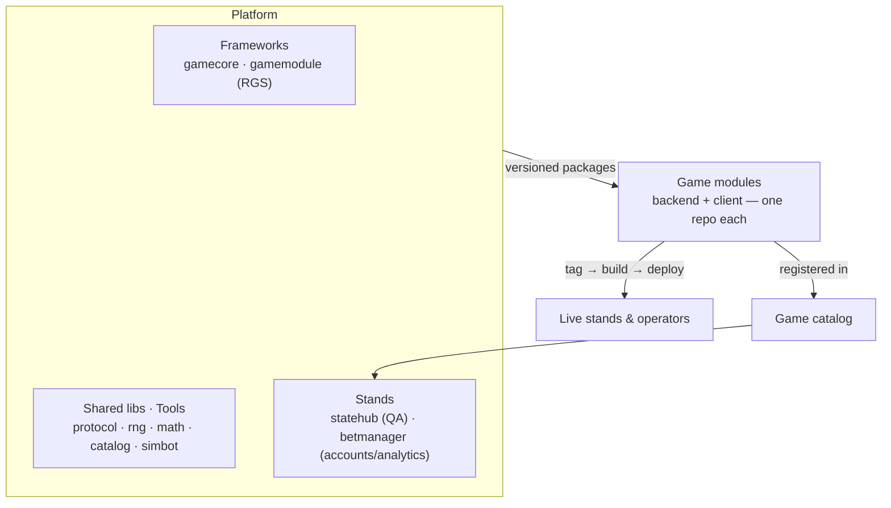

<picture>
  <source media="(prefers-color-scheme: dark)" srcset="assets/logo-dark.svg">
  
</picture>

### Spin. State. Repeat.

**A slot-games provider platform** — engine frameworks, a thin client renderer,
and the stands that test, catalog, and ship games.

[acidstates.com](https://acidstates.com)

---

## Platform at a glance

```mermaid
flowchart TD
  subgraph CORE["Platform"]
    FW["Frameworks\ngamecore · gamemodule (RGS)"]
    TOOLS["Shared libs · Tools\nprotocol · rng · math · catalog · simbot"]
    STANDS["Stands\nstatehub (QA) · betmanager (accounts/analytics)"]
  end
  CORE -->|versioned packages| GAMES["Game modules\nbackend + client — one repo each"]
  GAMES -->|tag → build → deploy| LIVE["Live stands & operators"]
  GAMES -->|registered in| CAT["Game catalog"]
  CAT --> STANDS
```

## How we build games

> **Install the framework as a package → write the module → its own repo → tag → deploy from the tag.**

Each game is a small, independent module that consumes a versioned framework — so games ship on
their own cadence while the platform evolves underneath them.

## Live now

**The Reactor** — a 6×5 periodic-table slot where the whole board lives inside a glass
aquarium tank: symbols settle under water behind a breathing surface, fed by a neon coolant
manifold, flanked by lab apparatus. The entire scene is procedural PixiJS v8 — canvas-baked
chrome, glass and glow, no sprite atlases — with the reels, win engine and RGS math driving it
underneath.

## Repositories

| Repo | What it is |
|---|---|
| [`platform`](https://github.com/acidstates/platform) | The monorepo: `gamecore` (TS + PIXI client framework) · `gamemodule` (Python/FastAPI RGS) · shared libs (protocol, rng, math, drawer, ui) · tools (registry/catalog, simbot) · stands (`statehub`, `betmanager`) · the agent knowledge base (`docs/agent`). |
| [`the-reactor`](https://github.com/acidstates/the-reactor) | Flagship game — RGS backend + PixiJS client, one monorepo. |
| [`game-template`](https://github.com/acidstates/game-template) | Starter for new game modules. |

## Products

| Surface | What it is |
|---|---|
| **gamecore / gamemodule** | The client renderer (TS + PixiJS v8) and the server RGS (Python + FastAPI). |
| **statehub** | QA test-stand — the game catalog with an embedded player, device mockups and test panels. |
| **betmanager** | Accounts, wallets, and analytics across games, players, and bets. |
| **catalog** | The registry mapping every game to its pinned `{module, client, drawer}`. |

## Agent-ready by design

The codebase ships its own operating manual for AI coding agents: `CLAUDE.md`/`AGENTS.md`
conventions in every repo, a battle-tested PixiJS hero-VFX style guide distilled from real
debugging rounds (`platform → docs/agent`), and the official
[pixijs-skills](https://github.com/pixijs/pixijs-skills) vendored into `.claude/skills/` with
org overlays verified against the installed `pixi.js@8.19.0` — so an agent's first drawing
session already knows the pitfalls a human only learns by shipping.

---

© AcidStates · built for scale, shipped on tags.

